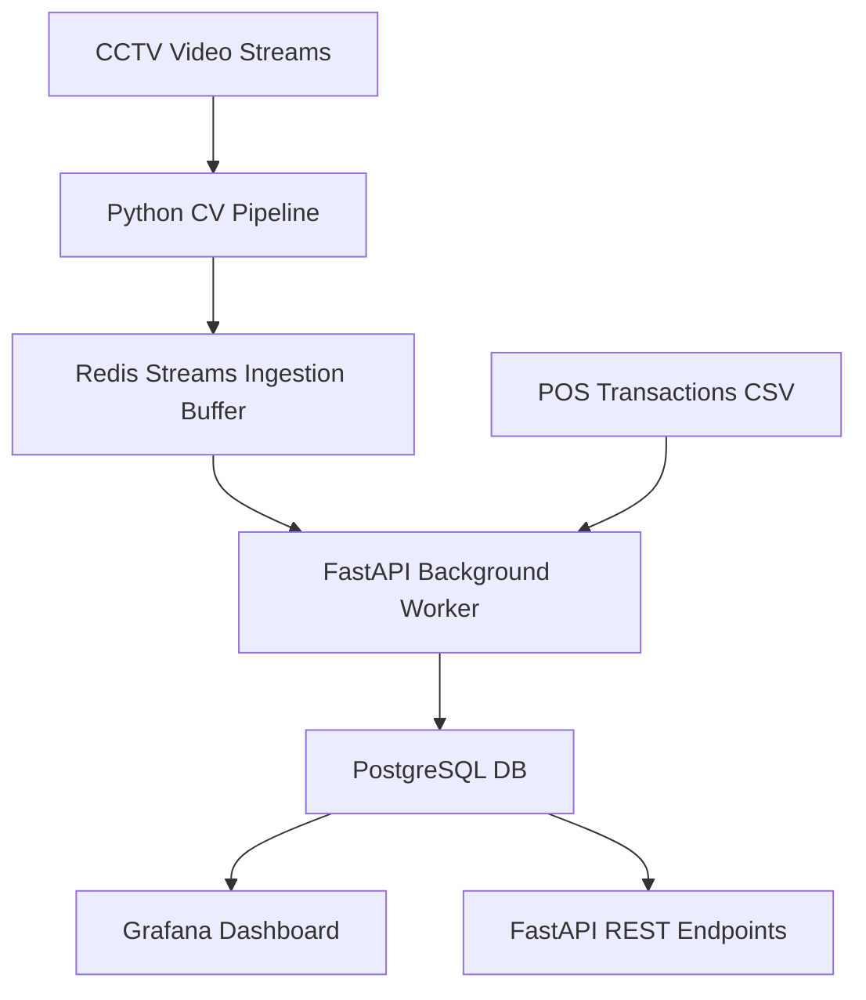

# Architecture Design - Store Intelligence System

Overview of the computer vision and ingestion system architecture.

## System Architecture

## AI-Assisted Decisions

*(To be compiled dynamically as the project develops)*
